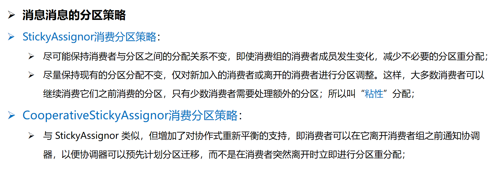
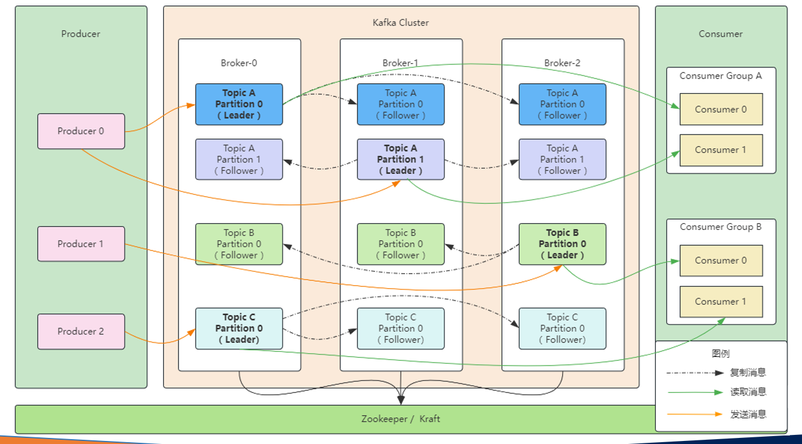
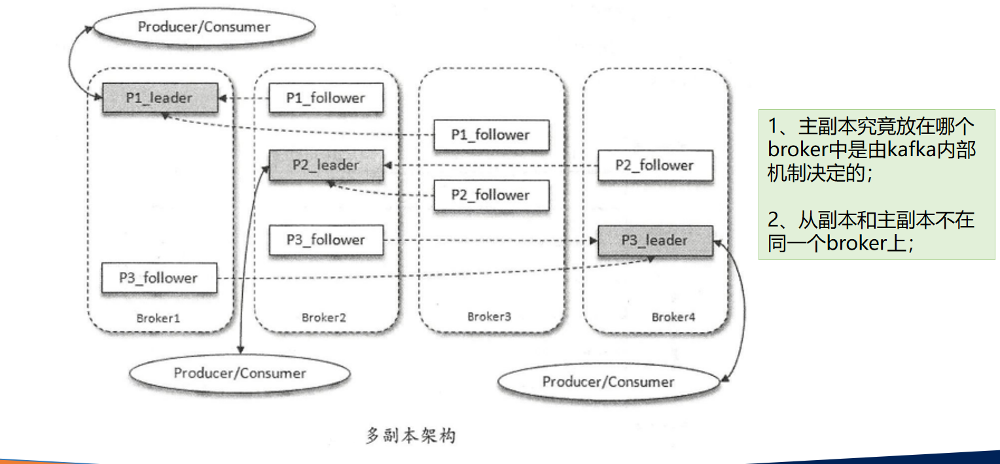
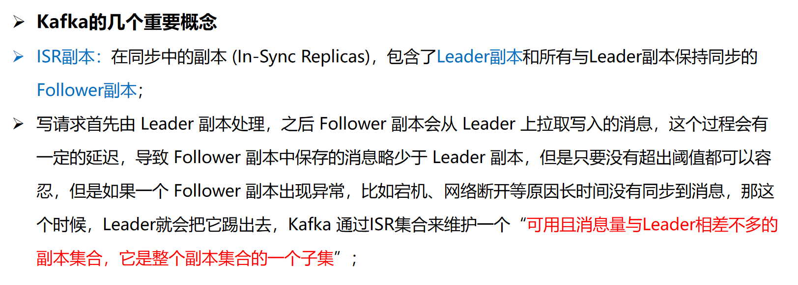
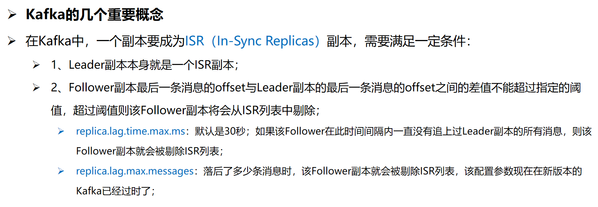
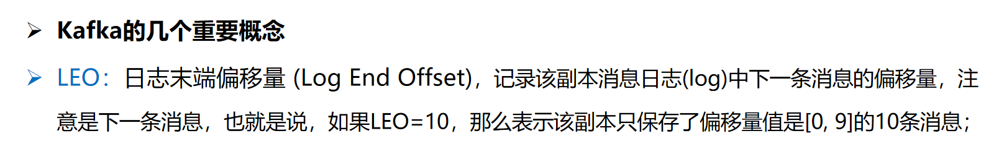
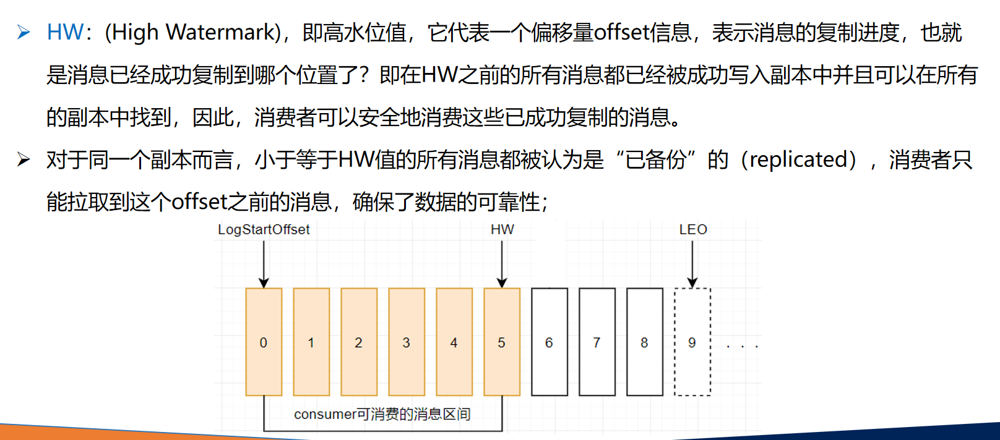
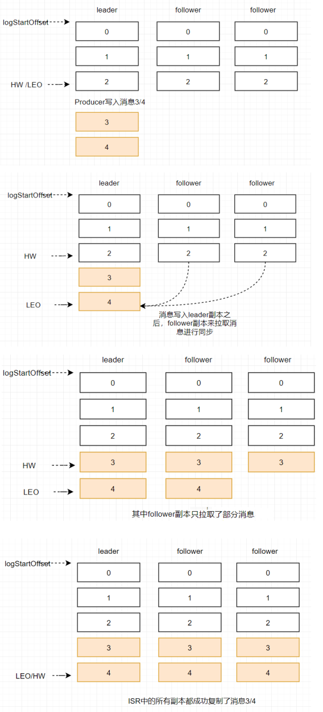
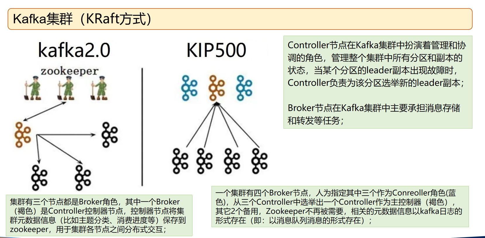

在Kafka的语境中，"payload"（有效载荷）通常指消息中实际传输的数据内容，即消息的主体部分。不过需要说明的是，Kafka原生API中并没有`@Payload`这样的注解，这一术语更多出现在框架或库的封装层（如Spring Kafka）中，用于标记方法参数或消息体内容。以下是结合消息队列原理和代码示例的解读：


---

### 一、消息的基本结构
Kafka消息由三个核心部分组成：
1. **Key（键）**：用于分区路由的标识符（如用户ID），决定消息存储到哪个分区。
2. **Value（值）**：即payload部分，实际传输的业务数据（如JSON、二进制等）。
3. **Headers（头信息）**：键值对形式的元数据，用于传递附加信息（如版本号、来源标识）。

在代码示例中，payload通常对应消息的`value`字段。例如网页8的Python示例：
```python
# 将字典payload转换为JSON字符串作为消息体
email_payload = {"to": "receiver@example.com", "subject": "Sample Email"}
p.produce(topic, payload.encode('utf-8'))  # payload即消息内容
```
此时payload会被序列化为字节流发送到Kafka。

---

### 二、框架中的@Payload注解
在Spring Kafka等框架中，`@Payload`注解用于明确标记方法参数应绑定到消息的value部分。例如：
```java
@KafkaListener(topics = "myTopic")
public void handleMessage(@Payload String payload, @Header(KafkaHeaders.RECEIVED_KEY) String key) {
    // 处理payload数据
}
```
这种用法将消息体与元数据（如key、headers）解耦，提升代码可读性。

---

### 三、Payload的实践注意事项
1. **序列化选择**  
   需根据数据类型配置序列化器（如JSON、Avro），如网页6的Go示例中使用了JSON序列化：
   ```go
   payload := map[string]string{"phoneNumber": "1234567890"}
   messageBuffer := Buffer.from(JSON.stringify(payload)) // 序列化为JSON
   ```

2. **大小限制**  
   Kafka默认单条消息最大为1MB，大payload需调整`message.max.bytes`参数。

3. **压缩优化**  
   可通过`compression.type`配置（如gzip、snappy）减少网络传输开销，如网页8的Python配置中启用了Snappy压缩。

---

### 四、与消息结构的对比
| 字段        | 作用域          | 示例值                          |
|------------|-----------------|--------------------------------|
| Key        | 分区路由         | 用户ID、订单号等业务标识          |
| **Payload**| 业务数据主体      | JSON订单数据、日志文本等          |
| Headers    | 元数据扩展       | 版本号(v1.0)、数据来源(web)      |

---

如果您的开发框架涉及`@Payload`注解，建议查阅对应框架文档（如[Spring Kafka文档](https://spring.io/projects/spring-kafka)）了解具体用法。原生Kafka中更关注消息的二进制内容处理和分区策略设计。


---

以下是关于 Kafka `ConsumerRecord` 的详细解析：

---

### 一、ConsumerRecord 的核心结构
`ConsumerRecord` 是 Kafka 消费者从主题分区中读取到的消息的封装对象，包含以下核心字段：
1. **`topic`**：消息所属的 Kafka 主题名称，如 `"order-events"`。
2. **`partition`**：消息所在分区的编号（从 0 开始）。
3. **`offset`**：消息在分区中的唯一位置标识，用于跟踪消费进度。
4. **`key`**：消息键（可选），用于分区路由，如用户 ID `"user_123"`。
5. **`value`**：消息主体（即 Payload），如 JSON 数据 `{"amount": 100}`。
6. **`timestamp`**：消息时间戳，区分生产者创建时间（`CREATE_TIME`）或 Broker 写入时间（`LOG_APPEND_TIME`）。
7. **`headers`**：键值对元数据，常用于传递校验码、版本号等附加信息。

示例代码中访问字段的方式：
```java
ConsumerRecord<String, String> record = ...;
System.out.println("Topic: " + record.topic());
System.out.println("Value: " + record.value()); // 输出消息主体
```

---

### 二、关键方法与扩展属性
除了基础字段，`ConsumerRecord` 提供以下实用方法：
| **方法**                     | **用途**                                                                 |
|------------------------------|--------------------------------------------------------------------------|
| `checksum()`                 | 返回消息 CRC32 校验码，用于数据完整性验证                                |
| `serializedKeySize()`        | 序列化后的键大小（字节数），若键为 null 则返回 -1                       |
| `serializedValueSize()`      | 序列化后的值大小，用于监控消息体积                                       |
| `timestampType()`            | 判断时间戳类型（`CREATE_TIME` 或 `LOG_APPEND_TIME`）                     |

特殊常量：
- **`NO_TIMESTAMP`**：当消息无时间戳时返回的默认值（-1）。
- **`NULL_SIZE`**：表示键/值为 null 时的序列化大小（-1）。

---

### 三、使用场景与最佳实践
#### 1. **消费者组模式**
通过 `subscribe()` 订阅主题，Kafka 自动分配分区（消费者组模式）：
```java
consumer.subscribe(Arrays.asList("topic1"));
ConsumerRecords<String, String> records = consumer.poll(Duration.ofMillis(1000));
for (ConsumerRecord<String, String> record : records) {
    // 处理每条消息
}
```
- **配置要点**：需设置 `group.id` 标识消费者组，`enable.auto.commit` 控制偏移量提交。

#### 2. **手动分配分区**
通过 `assign()` 直接指定分区（无消费者组）：
```java
TopicPartition partition = new TopicPartition("topic1", 0);
consumer.assign(Collections.singletonList(partition)); // 精确控制特定分区
```
- **适用场景**：需要固定消费者与分区绑定的场景，如审计日志处理。

#### 3. **反序列化配置**
需显式指定键值反序列化器：
```properties
props.put("key.deserializer", "org.apache.kafka.common.serialization.StringDeserializer");
props.put("value.deserializer", "org.apache.kafka.common.serialization.JsonDeserializer");
```

---

### 四、注意事项
1. **版本兼容性**  
   不同 Kafka 版本可能在字段或方法上存在差异（如早期版本无 `headers` 字段），需核对客户端版本。

2. **消息处理逻辑**
   - 避免在 `poll()` 循环内执行耗时操作，防止触发 `max.poll.interval.ms` 超时导致消费者被踢出组。
   - 大消息需调整 `message.max.bytes` 参数，防止消费失败。

3. **偏移量管理**  
   若禁用自动提交（`enable.auto.commit=false`），需手动调用 `commitSync()` 或 `commitAsync()` 提交偏移量。

---

### 五、与 ConsumerRecords 的关系
`ConsumerRecords` 是 `ConsumerRecord` 的容器类，提供以下功能：
- `count()`：获取总消息数
- `partitions()`：返回包含数据的分区集合
- `records(TopicPartition)`：获取特定分区的消息列表

示例遍历：
```java
ConsumerRecords<String, String> records = consumer.poll(Duration.ofMillis(1000));
records.partitions().forEach(partition -> {
    List<ConsumerRecord<String, String>> partitionRecords = records.records(partition);
    // 按分区批量处理
});
```

---

如果需要更深入的代码实践（如自定义反序列化、处理消息头），可参考 [Kafka 官方文档](https://kafka.apache.org/documentation/) 或 Spring Kafka 的 `@Payload` 注解高级用法。

---

## 示例：

```java
package com.fire.kafkaeasystudy02.consumer;

import org.apache.kafka.clients.consumer.ConsumerRecord;
import org.springframework.kafka.annotation.KafkaListener;
import org.springframework.kafka.support.KafkaHeaders;
import org.springframework.messaging.handler.annotation.Header;
import org.springframework.messaging.handler.annotation.Payload;
import org.springframework.stereotype.Component;

@Component
public class EventConsumer {
    // 采用监听的方式接收事件(消息、数据)
    @KafkaListener(topics = {"helloTopic"},groupId = "helloGroup")
    public void onEvent(@Payload String event,
                        @Header(value = KafkaHeaders.RECEIVED_TOPIC) String topic,
//                        @Header(value = KafkaHeaders.RECEIVED_KEY) String key,
                        @Header(value = KafkaHeaders.RECEIVED_PARTITION) String partition,
                        ConsumerRecord<String, String> record) {
//        System.out.println("读取的事件："+event + ", topic:"+topic+", key:"+key+", partition:"+partition);
        System.out.println("读取的事件："+event + ", topic:"+topic+", partition: "+partition);
        System.out.println("读取的事件："+record.toString());

    }
    
}

```


在Kafka中，接收消息监听器的手动确认机制是确保消息处理可靠性的核心功能。通过手动确认，开发者可以控制消息消费的完成时机，避免因自动提交导致的数据丢失或重复消费。以下是实现手动确认的具体方法及注意事项：

---

### **1. 配置手动确认**
需在Spring Boot的`application.properties`中关闭自动提交，并设置手动确认模式：
```properties
spring.kafka.consumer.enable-auto-commit=false  # 关闭自动提交
spring.kafka.listener.ack-mode=manual          # 设置为手动确认模式
```
此配置要求消费者在处理完消息后显式调用确认方法。

---

### **2. 监听器实现手动确认**
在`@KafkaListener`方法中添加`Acknowledgment`参数，并在业务逻辑完成后调用`acknowledge()`方法：
```java
@KafkaListener(topics = "topic_input", groupId = "group01")
public void listen(ConsumerRecord<?, String> record, Acknowledgment ack) {
    try {
        System.out.println("处理消息: " + record.value());
        // 业务逻辑（如数据库操作）
        ack.acknowledge();  // 手动确认
    } catch (Exception e) {
        // 异常处理，不调用acknowledge()，消息会重新投递
    }
}
```
**关键点**：
- 确认操作应在业务逻辑完全成功后执行，例如数据库事务提交后。
- 若处理失败且未确认，Kafka会重新投递消息（需结合重试机制）。

---

### **3. 错误处理与重试**
手动确认需配合错误处理器以增强健壮性：
- **重试机制**：通过`DefaultErrorHandler`配置重试策略，例如最多重试3次，每次间隔1秒。
- **死信队列（DLQ）**：最终失败的消息可转发到死信主题，避免阻塞正常消费：
```java
@Bean
public DefaultErrorHandler errorHandler(KafkaTemplate<Object, Object> template) {
    var recoverer = new DeadLetterPublishingRecoverer(template);  // 转发到DLQ
    var backoff = new FixedBackoff(1000L, 3);  // 重试3次，间隔1秒
    return new DefaultErrorHandler(recoverer, backoff);
}
```

---

### **4. 同步与异步提交**
- **同步提交（commitSync）**：确保提交成功后再继续消费，但可能降低吞吐量。
- **异步提交（commitAsync）**：提升性能，但需处理提交失败：
```java
consumer.commitAsync((offsets, exception) -> {
    if (exception != null) {
        System.err.println("提交失败: " + exception.getMessage());
    }
});
```

---

### **5. 注意事项**
- **消息顺序保证**：手动确认时需确保单线程处理，避免并发导致乱序。
- **偏移量管理**：未确认的消息会重复投递，业务逻辑需幂等处理。
- **性能调优**：批量处理时，可在所有消息处理完成后一次性确认，减少提交频率。

---

**总结**：手动确认通过`Acknowledgment`接口实现，结合错误处理、重试机制及死信队列，可构建高可靠的Kafka消费者。需注意同步/异步提交的取舍，以及业务逻辑的幂等性设计。

---

## 示例

```java
 // 采用监听的方式接收事件(消息、数据)
//    listener:
//        # 开启消息监听的手动确认模式
//        ack-mode: manual
    @KafkaListener(topics = {"${kafka.topic.name}"},groupId = "${kafka.consumer.group}")
    public void onEvent4(String userJSON,
                         @Header(value = KafkaHeaders.RECEIVED_TOPIC) String topic,
//                        @Header(value = KafkaHeaders.RECEIVED_KEY) String key,
                         @Header(value = KafkaHeaders.RECEIVED_PARTITION) String partition,
                         ConsumerRecord<String, String> record,
                         Acknowledgment ack) {
//        System.out.println("读取的事件："+event + ", topic:"+topic+", key:"+key+", partition:"+partition);
        // 收到消息后，处理业务
        try {
            User user = JSONUtils.toBean(userJSON, User.class);
            System.out.println("读取的事件4：" + user + ", topic:" + topic + ", partition: " + partition);
            System.out.println("读取的事件4：" + record.toString());
            // 业务处理完成，给kafka服务器确认
            ack.acknowledge(); // 手动确认消息，就是告诉kafka服务器，该消息我已经收到了，默认情况下kafka是自动确认
        }catch (Exception e){
            e.printStackTrace();
        }
        

    }
```

默认情况下，Kafka消费者消费消息后会自动发送确认信息给Kafka服务器，表示消息已经被成功消费。但在某些场景下，我们希望在消息处理成功后再发送确认，或者在消息处理失败时选择不发送确认，以便Kafka能够重新发送该消息；


---

在Kafka中，通过指定Topic、Partition及Offset实现精准消费消息是常见的需求，以下是具体实现方法与注意事项：

---

### **1. Spring Boot集成Kafka的注解方式**
在Spring Boot应用中，可通过`@KafkaListener`的`topicPartitions`参数精确控制消费位置：
```java
@KafkaListener(
    id = "consumer1",
    groupId = "my-group1",
    topicPartitions = {
        @TopicPartition(topic = "topic1", partitions = {"0"}),  // 监听topic1的0号分区
        @TopicPartition(
            topic = "topic2",
            partitions = "1",
            partitionOffsets = @PartitionOffset(partition = "1", initialOffset = "100")  // 指定初始Offset为100
        )
    }
)
public void listen(String message) {
    System.out.println("Received: " + message);
}
```
**说明**：
- `partitions`：直接指定消费的分区编号。
- `partitionOffsets`：通过`initialOffset`设置分区的起始偏移量。
- 需关闭自动提交（`enable.auto.commit=false`），避免Offset被自动覆盖。

---

### **2. 原生Kafka API实现精准消费**
通过`KafkaConsumer`手动分配分区并定位Offset：
```java
// 1. 初始化消费者并分配分区
consumer.assign(Collections.singletonList(new TopicPartition("topic1", 0)));

// 2. 定位到指定Offset
consumer.seek(new TopicPartition("topic1", 0), 100L);  // 从Offset=100开始消费

// 3. 拉取消息
ConsumerRecords<String, String> records = consumer.poll(Duration.ofMillis(1000));
for (ConsumerRecord<String, String> record : records) {
    System.out.printf("Offset=%d, Value=%s%n", record.offset(), record.value());
}

// 4. 手动提交Offset（可选）
consumer.commitSync();
```
**关键点**：
- `assign()`：手动分配分区，替代`subscribe()`的自动分配。
- `seek()`：直接跳转到指定Offset，适用于精确控制消费起点。
- 需结合`enable.auto.commit=false`关闭自动提交。

---

### **3. 通过时间戳查找Offset消费**
若需从特定时间点开始消费，可先将时间转换为Offset：
```java
// 1. 查询时间戳对应的Offset
Map<TopicPartition, OffsetAndTimestamp> offsets = consumer.offsetsForTimes(
    Collections.singletonMap(new TopicPartition("topic1", 0), timestamp), 
    Duration.ofSeconds(10)
);

// 2. 定位到该Offset
if (offsets != null && !offsets.isEmpty()) {
    consumer.seek(new TopicPartition("topic1", 0), offsets.get().offset());
}
```
此方法常用于故障恢复后重新消费特定时间段的数据。

---

### **4. 消费者配置参数控制起始Offset**
通过`auto.offset.reset`设置默认消费起点：
```properties
auto.offset.reset=earliest  # 从最早消息开始（Offset=0）
auto.offset.reset=latest    # 从最新消息开始（默认值）
auto.offset.reset=none      # 无有效Offset时抛出异常
```
**适用场景**：
- 新消费者组首次启动时，无历史Offset记录的场景。
- 需配合`group.id`使用，不同消费者组的Offset独立存储。

---

### **5. 注意事项**
1. **Offset有效性验证**：
   - 检查Offset是否在分区有效范围内（`earliestOffset ≤ target ≤ latestOffset`），避免因Kafka数据清理导致无效Offset。
   - 通过`consumer.beginningOffsets()`和`consumer.endOffsets()`获取分区Offset范围。

2. **提交策略**：
   - **同步提交**（`commitSync()`）：确保提交成功，但降低吞吐量。
   - **异步提交**（`commitAsync()`）：提升性能，需处理回调失败。

3. **幂等性设计**：
   - 因Offset可能重复消费（如手动提交失败），业务逻辑需支持幂等处理。

---

### **总结**
- **Spring Boot场景**：优先使用`@KafkaListener`的`topicPartitions`参数指定消费位置。
- **原生API场景**：结合`assign()`+`seek()`实现精准控制。
- **运维场景**：通过`kafka-consumer-groups`命令行工具重置Offset（如`--reset-offsets --to-offset`）。

---

# 消费者批量消费消息
1. 设置application.prpertise开启批量消费；
- 设置批量消费 `spring.kafka.listener.type=batch`
- 批量消费每次最多消费多少条消息 `spring.kafka.consumer.max-poll-records=100`


2. 接收消息时用List来接收；
```java
@KafkaListener(groupId = "helloGroup", topics = "helloTopic")
public void onEvent(List<ConsumerRecord<String, String>> records) {
    System.out.println("批量消费，records.size() = " + records.size() + "，records = " + records);
}
```

## 示例

```java
   @KafkaListener(topics = {"batchTopic"},groupId = "batchGroup")
    public void onEvent6(List<ConsumerRecord<String, String>> records) {
        System.out.println("批量消费,records.size()="+records.size()+",recods="+records);
    }
```

```java
 public void sendEvent4() {
        for (int i = 0; i < 125; i++) {
            User user  = User.builder().id(i).phone("13345232"+i).birthday(new Date()).build();
            String userJSON = JSONUtils.toJSON(user);
            kafkaTemplate.send("batchTopic","k" + i,userJSON);
        }
    }
```

---

# 消费消息时的消息拦截
在消息消费之前，我们可以通过配置拦截器对消息进行拦截，在消息被实际处理之前对其进行一些操作，例如记录日志、修改消息内容或执行一些安全检查等；


1. 实现kafka的ConsumerInterceptor拦截器接口；
```java
public class CustomConsumerInterceptor implements ConsumerInterceptor<String, String> {
    ......
}
```
2. 在Kafka消费者的ConsumerFactory配置中注册这个拦截器：
```java
props.put(ConsumerConfig.INTERCEPTOR_CLASSES_CONFIG, CustomConsumerInterceptor.class.getName());
```
3. 监听消息时使用我们的监听器容器工厂Bean
```java
@KafkaListener(topics = {"intTopic"}, groupId = "intGroup", containerFactory = "ourKafkaListenerContainerFactory")
```

---


在Kafka开发中，消息转发是实现业务解耦、跨系统协作的关键技术。以下是基于不同场景的常用实现方式及注意事项：


---

### **一、消息转发实现方式**
1. **Spring Kafka的`@SendTo`注解**  
   通过监听器返回值自动转发消息到指定Topic，适用于单次转发场景。
   - **实现步骤**：
      - 在监听方法上添加`@KafkaListener`和`@SendTo("目标Topic")`注解。
      - 配置`ConcurrentKafkaListenerContainerFactory`的`ReplyTemplate`（需提前定义生产者配置）。
   - **示例代码**：
     ```java
     @KafkaListener(topics = "topic1")
     @SendTo("topic2")
     public String forwardMessage(ConsumerRecord<?, ?> record) {
         return record.value() + "-forward";
     }
     ```

2. **`ReplyingKafkaTemplate`请求-响应模式**  
   适用于需要等待下游系统响应的场景（如订单审核后需要物流系统反馈）。
   - **核心流程**：
      - 生产者发送消息时指定回复Topic（通过Headers设置`KafkaHeaders.REPLY_TOPIC`）。
      - 消费者处理消息后，将结果发送到回复Topic，由`ReplyingKafkaTemplate`异步接收响应。
   - **优势**：支持超时控制和异步处理，但需注意响应延迟问题。

3. **手动转发（生产者显式调用）**  
   灵活性高，适用于复杂业务逻辑（如动态选择目标Topic或消息转换）。
   - **实现要点**：
      - 在消费者代码中注入`KafkaTemplate`，直接调用`send()`方法。
      - 可结合消息过滤（如根据消息内容选择转发路径）。

---

### **二、注意事项**
1. **生产者配置**
   - 转发场景中，消费者同时作为生产者，需配置序列化方式、ACK机制（如`acks=all`确保可靠性）及重试策略。
   - **示例配置**（Spring Boot）：
     ```properties
     spring.kafka.producer.bootstrap-servers=localhost:9092
     spring.kafka.producer.key-serializer=org.apache.kafka.common.serialization.StringSerializer
     spring.kafka.producer.value-serializer=org.apache.kafka.common.serialization.StringSerializer
     ```

2. **消息过滤与转换**
   - 可在转发前对消息内容进行过滤（如丢弃无效数据）或格式转换（如JSON转Avro）。
   - **过滤示例**（仅转发偶数消息）：
     ```java
     @Bean
     public RecordFilterStrategy<Integer, String> filterStrategy() {
         return record -> Integer.parseInt(record.value()) % 2 != 0;
     }
     ```

3. **分区与负载均衡**
   - 若目标Topic有多个分区，需指定分区策略（如按Key哈希）或使用默认轮询。
   - 消费者组需合理分配分区，避免消息处理倾斜。

4. **错误处理与重试**
   - 手动转发时需捕获`ProducerException`，并实现重试逻辑（如指数退避）。
   - 使用`@RetryableTopic`（Spring Kafka 2.7+）可自动重试失败的消息。

---

### **三、工具与扩展**
- **Kafka Magic**：可视化工具支持消息的跨Topic转换和批量转发，适合调试与集成测试。
- **MirrorMaker 2.0**：用于跨集群消息复制（如灾备场景），支持双向同步和Topic重命名规则。

---

### **总结**
消息转发在Kafka中的实现需根据业务需求选择合适方案：简单场景用`@SendTo`，需响应反馈时用`ReplyingKafkaTemplate`，复杂逻辑则手动控制。开发时需关注生产者配置、消息过滤及异常处理，必要时借助工具提升效率。

---

Kafka的消费者分区分配策略决定了消费组内各消费者如何分配Topic的分区资源，以实现负载均衡和高可用性。以下是常见的分区策略及其核心机制：


---

### **一、内置分区策略**





1. **RangeAssignor（范围分配策略）**
    - **机制**：
        - 按主题逐个处理，对每个主题的分区按序号排序，消费者按名称排序。
        - 每个主题的分区数除以消费者数，余数部分分配给前几个消费者。
    - **示例**：  
      若Topic有10个分区，3个消费者，分配结果为：
        - Consumer1：0-3（4个分区）
        - Consumer2：4-6（3个分区）
        - Consumer3：7-9（3个分区）
    - **特点**：
        - 默认策略，适合单主题消费，但多主题时可能导致负载不均（如不同主题分区数差异较大）。

2. **RoundRobinAssignor（轮询分配策略）**
    - **机制**：
        - 将所有Topic的分区合并后按哈希值排序，轮询分配给消费者。
    - **示例**：  
      Topic1（4分区）和Topic2（4分区）分配给3个消费者：
        - Consumer1：Topic1-0、Topic2-1、Topic2-3
        - Consumer2：Topic1-1、Topic2-0
        - Consumer3：Topic1-2、Topic1-3、Topic2-2
    - **特点**：
        - 多主题场景下分配更均匀，但需保证消费者订阅相同的Topic列表。

3. **StickyAssignor（粘性分配策略）**
    - **机制**：
        - 优先保留原有分配结果，仅在新增/减少消费者时调整部分分区，减少重平衡影响。
    - **示例**：  
      原Consumer1和Consumer2各分配2个分区，新增Consumer3后：
        - Consumer1和Consumer2各保留1个分区，剩余2个分配给Consumer3。
    - **特点**：
        - 减少分区迁移开销，避免因频繁重平衡导致的消费中断。

4. **CooperativeStickyAssignor（协作粘性策略）**
    - **机制**：
        - 在Sticky基础上支持增量重平衡（逐步迁移分区），消费者无需暂停消费。
    - **特点**：
        - 需Kafka 2.4+版本，适合高可用场景，减少消费停顿时间。

---

### **二、策略选择建议**
| **场景**               | **推荐策略**               | **原因**                                                                 |
|------------------------|--------------------------|-------------------------------------------------------------------------|
| 单主题消费              | RangeAssignor            | 简单高效，分区按范围连续分配。                                       |
| 多主题消费              | RoundRobinAssignor       | 全局轮询，负载更均衡。                                              |
| 需减少重平衡影响        | StickyAssignor           | 保留原有分配，降低迁移成本。                                     |
| 高版本集群（Kafka 2.4+）| CooperativeStickyAssignor| 增量迁移减少中断，支持平滑扩展。                                          |
| 自定义业务需求          | 自定义策略                | 实现`PartitionAssignor`接口，按业务逻辑分配（如按地域或数据类型）。            |

---

### **三、注意事项**
1. **分区与消费者数量关系**
    - 分区数 < 消费者数：部分消费者闲置。
    - 分区数 > 消费者数：单个消费者可能处理多个分区。

2. **重平衡（Rebalance）触发条件**
    - 消费者加入/退出、订阅Topic变化、分区数变更。

3. **性能与稳定性**
    - Sticky策略可减少因频繁重平衡导致的资源浪费。
    - 避免过多消费者导致频繁重平衡，建议分区数为消费者数的整数倍。

---

### **四、配置示例（Java）**
```java
Properties props = new Properties();
props.put("group.id", "test-group");
props.put("bootstrap.servers", "localhost:9092");
// 设置分区策略（支持多个策略，按优先级选择）
props.put("partition.assignment.strategy", 
    "org.apache.kafka.clients.consumer.CooperativeStickyAssignor");
KafkaConsumer<String, String> consumer = new KafkaConsumer<>(props);
```

---

通过合理选择分区策略，可以优化消费组的吞吐量、负载均衡及容错能力。具体策略需结合业务场景、Kafka版本及集群规模综合评估。


---

# Kafka事件(消息、数据)的存储


- kafka的所有事件(消息、数据)都存储在/tmp/kafka-logs目录中，可通过log.dirs=/tmp/kafka-logs配置；
- Kafka的所有事件(消息、数据)都是以日志文件的方式来保存；
- Kafka一般都是海量的消息数据，为了避免日志文件过大，日志文件被存放在多个日志目录下，日志目录的命名规则为：<topic_name>-<partition_id>；
- 比如创建一个名为 firstTopic 的 topic，其中有 3 个 partition，那么在 kafka 的数据目录（/tmp/kafka-log）中就有 3 个目录，firstTopic-0、firstTopic-1、firstTopic-2；
  - 00000000000000000000.index  消息索引文件
  - 00000000000000000000.log  消息数据文件
  - 00000000000000000000.timeindex  消息的时间戳索引文件
  - 00000000000000000006.snapshot  快照文件，生产者发生故障或重启时能够恢复并继续之前的操作
  - leader-epoch-checkpoint  记录每个分区当前领导者的epoch以及领导者开始写入消息时的起始偏移量
  - partition.metadata  存储关于特定分区的元数据（metadata）信息
- 每次消费一个消息并且提交以后，会保存当前消费到的最近的一个offset；
- 在kafka中，有一个__consumer_offsets的topic， 消费者消费提交的offset信息会写入到 该topic中，__consumer_offsets保存了每个consumer group某一时刻提交的offset信息，__consumer_offsets默认有50个分区；
- consumer_group 保存在哪个分区中的计算公式：
- Math.abs(“groupid”.hashCode())%groupMetadataTopicPartitionCount ; 

## Offset详解

### 1. 生产者Offset
- 生产者发送一条消息到Kafka的broker的某个topic下某个partition中；
- Kafka内部会为每条消息分配一个唯一的offset，该offset就是该消息在partition中的位置；

### 2. 消费者Offset
- 消费者offset是消费者需要知道自己已经读取到哪个位置了，接下来需要从哪个位置开始继续读取消息；
- 每个消费者组（Consumer Group）中的消费者都会独立地维护自己的offset，当消费者从某个partition读取消息时，它会记录当前读取到的offset，这样，即使消费者崩溃或重启，它也可以从上次读取的位置继续读取，而不会重复读取或遗漏消息；（注意：消费者offset需要消费消息并提交后才记录offset）

1、每个消费者组启动开始监听消息，默认从消息的最新的位置开始监听消息，即把最新的位置作为消费者offset；
- 分区中还没有发送过消息，则最新的位置就是0；
- 分区中已经发送过消息，则最新的位置就是生产者offset的下一个位置；


2、消费者消费消息后，如果不提交确认（ack），则offset不更新，提交了才更新；

命令行命令：./kafka-consumer-groups.sh --bootstrap-server 127.0.0.1:9092 --group osGroup --describe

结论：消费者从什么位置开始消费，就看消费者的offset是多少，消费者offset是多少，它启动后，可以通过上面的命令查看；


---

# 查看消费者组的实时消费状态


`kafka-consumer-groups.sh --bootstrap-server localhost:9092 --group offsetGroup --describe` 是 Kafka 提供的用于查看指定消费者组详细状态的命令行工具。以下是对该命令的逐层解析：

---

### **一、命令作用**
该命令用于查看名为 `offsetGroup` 的消费者组的实时消费状态，包括分区偏移量、消息积压量、消费者成员信息等核心指标。

---

### **二、参数说明**
1. **`--bootstrap-server localhost:9092`**
   - 指定 Kafka 集群的 Broker 地址列表，此处为本地单节点集群的默认端口（9092）。
   - 替代旧版 `--zookeeper` 参数，直接通过 Broker 获取消费者组信息。

2. **`--group offsetGroup`**
   - 指定目标消费者组名称，仅显示该组的详细信息。

3. **`--describe`**
   - 输出消费者组的订阅详情，包括每个分区的消费进度、消息积压量等。

---

### **三、输出结果解析**
执行命令后，输出的典型字段如下（以示例数据说明）：

| **字段**          | **说明**                                                                                       | **示例值**                                |
|--------------------|-----------------------------------------------------------------------------------------------|-------------------------------------------|
| **TOPIC**          | 消费者订阅的主题名称                                                                           | `order-topic`                             |
| **PARTITION**      | 分区编号（Kafka 并行处理的基本单位）                                                            | `0`                                       |
| **CURRENT-OFFSET** | 消费者组当前已提交的偏移量（最后一条已消费消息的位置）                                         | `668`                                     |
| **LOG-END-OFFSET** | 分区的日志末端偏移量（最新生产的消息位置）                                                     | `668`                                     |
| **LAG**            | 积压消息数量（`LOG-END-OFFSET - CURRENT-OFFSET`，0 表示无积压）                               | `0`                                       |
| **CONSUMER-ID**    | 消费者实例的唯一标识，格式为 `consumer-<clientId>-<UUID>`                                      | `consumer-1-063cdec2-b525-4ba3-bbfe...`   |
| **HOST**           | 消费者实例所在的服务器 IP 地址                                                                 | `/192.168.0.2`                            |
| **CLIENT-ID**      | 客户端自定义的标识符（由消费者启动时指定）                                                     | `consumer-1`                              |

---

### **四、关键场景应用**
1. **监控消息积压**
   - 若 `LAG` 值持续增长，可能因消费者处理速度不足或分区分配不均导致，需优化消费者线程池或扩容分区。
2. **定位异常消费者**
   - 通过 `CONSUMER-ID` 和 `HOST` 可追踪具体消费者实例的运行状态，排查宕机或性能瓶颈。
3. **验证分区均衡性**
   - 对比不同分区的 `LAG` 值，若差异过大，可能需调整分区数或消费者实例数量。

---

### **五、注意事项**
- **消费者组状态**：若消费者组无活跃成员，输出中可能显示 `No active members`，需结合 `--state` 参数查看组状态（如 Stable、Dead）。
- **权限要求**：需确保对 Kafka Broker 有读权限，否则可能因权限不足无法获取信息。
- **版本兼容性**：Kafka 2.0+ 版本已弃用 ZooKeeper 参数，必须使用 `--bootstrap-server`。

通过此命令，可快速诊断消费者组健康状态，为优化消息处理流程提供数据支持。如需进一步操作（如重置偏移量），可结合 `--reset-offsets` 参数实现。


---

基于在WSL2的Linux子系统中部署Kafka集群的需求，结合容器化技术的最佳实践，以下是分步实施方案：

---







### **一、编写Docker Compose配置文件**
创建`docker-compose.yml`文件，定义ZooKeeper和3个Kafka节点的集群架构：
```yaml
version: '3'
services:
  zookeeper:
    image: confluentinc/cp-zookeeper:latest
    container_name: zookeeper
    ports:
      - "2181:2181"
    environment:
      ZOOKEEPER_CLIENT_PORT: 2181
      ZOOKEEPER_TICK_TIME: 2000
    networks:
      - kafka-net

  kafka1:
    image: confluentinc/cp-kafka:latest
    container_name: kafka1
    depends_on:
      - zookeeper
    ports:
      - "9092:9092"
    environment:
      KAFKA_BROKER_ID: 1
      KAFKA_ZOOKEEPER_CONNECT: zookeeper:2181
      KAFKA_LISTENER_SECURITY_PROTOCOL_MAP: INTERNAL:PLAINTEXT,EXTERNAL:PLAINTEXT
      KAFKA_LISTENERS: INTERNAL://0.0.0.0:29092,EXTERNAL://0.0.0.0:9092
      KAFKA_ADVERTISED_LISTENERS: INTERNAL://kafka1:29092,EXTERNAL://localhost:9092
      KAFKA_INTER_BROKER_LISTENER_NAME: INTERNAL
      KAFKA_AUTO_CREATE_TOPICS_ENABLE: "true"
    networks:
      - kafka-net

  kafka2:
    image: confluentinc/cp-kafka:latest
    container_name: kafka2
    depends_on:
      - zookeeper
    ports:
      - "9093:9092"
    environment:
      KAFKA_BROKER_ID: 2
      KAFKA_ZOOKEEPER_CONNECT: zookeeper:2181
      KAFKA_LISTENER_SECURITY_PROTOCOL_MAP: INTERNAL:PLAINTEXT,EXTERNAL:PLAINTEXT
      KAFKA_LISTENERS: INTERNAL://0.0.0.0:29092,EXTERNAL://0.0.0.0:9092
      KAFKA_ADVERTISED_LISTENERS: INTERNAL://kafka2:29092,EXTERNAL://localhost:9093
      KAFKA_INTER_BROKER_LISTENER_NAME: INTERNAL
    networks:
      - kafka-net

  kafka3:
    image: confluentinc/cp-kafka:latest
    container_name: kafka3
    depends_on:
      - zookeeper
    ports:
      - "9094:9092"
    environment:
      KAFKA_BROKER_ID: 3
      KAFKA_ZOOKEEPER_CONNECT: zookeeper:2181
      KAFKA_LISTENER_SECURITY_PROTOCOL_MAP: INTERNAL:PLAINTEXT,EXTERNAL:PLAINTEXT
      KAFKA_LISTENERS: INTERNAL://0.0.0.0:29092,EXTERNAL://0.0.0.0:9092
      KAFKA_ADVERTISED_LISTENERS: INTERNAL://kafka3:29092,EXTERNAL://localhost:9094
      KAFKA_INTER_BROKER_LISTENER_NAME: INTERNAL
    networks:
      - kafka-net

networks:
  kafka-net:
    driver: bridge
```

---

### **二、启动集群**
1. **运行Docker Compose**
   ```bash
   docker-compose up -d
   ```
   - 验证容器状态：`docker ps`应显示4个运行中的容器（1个ZooKeeper，3个Kafka）。

2. **检查集群健康状态**
   ```bash
   # 查看Kafka Broker元数据
   docker exec kafka1 kafka-broker-api-versions --bootstrap-server localhost:9092
   ```

---

### **三、验证集群功能**
1. **创建测试Topic**
   ```bash
   docker exec kafka1 kafka-topics --create --bootstrap-server localhost:9092 \
   --topic test-topic --partitions 3 --replication-factor 2
   ```

2. **模拟生产与消费**
   - **生产者**（新终端窗口）：
     ```bash
     docker exec -it kafka1 bash
     kafka-console-producer --bootstrap-server localhost:9092 --topic test-topic
     ```
   - **消费者**（另一终端窗口）：
     ```bash
     docker exec -it kafka2 bash
     kafka-console-consumer --bootstrap-server localhost:9093 --topic test-topic --from-beginning
     ```

3. **查看Topic分布**
   ```bash
   docker exec kafka1 kafka-topics --describe --topic test-topic --bootstrap-server localhost:9092
   ```
   输出应显示分区分布在多个Broker上（例如`Leader: 1, Replicas: 1,2`）。

---

### **四、网络与存储优化**
1. **端口映射**
   - 通过`ports`将容器端口映射到宿主机（WSL2的Ubuntu）的不同端口（9092-9094），确保宿主机可通过`localhost:9092`访问集群。

2. **数据持久化**（可选）  
   在`docker-compose.yml`中添加卷挂载，防止容器重启后数据丢失：
   ```yaml
   volumes:
     - ./kafka1-data:/var/lib/kafka/data
   ```

---

### **五、常见问题**
- **端口冲突**：若端口被占用，调整`ports`字段中的宿主机端口（如9095:9092）。
- **容器启动失败**：检查日志`docker logs kafka1`，常见原因是ZooKeeper连接失败或Broker ID重复。
- **跨节点通信问题**：确保所有Kafka节点的`KAFKA_ADVERTISED_LISTENERS`配置为宿主机可访问的地址（如本地IP）。

---

通过上述步骤，可在WSL2的Linux子系统中快速搭建一个高可用的Kafka伪分布式集群。如需可视化监控，可参考Kafdrop工具。


---


Kafka 中的 **ISR 副本**、**LEO** 和 **HW** 是保障数据一致性、高可用性和消费者可见性的核心机制。以下是它们的定义、作用及相互关系：

---

### 一、ISR 副本（In-Sync Replicas）






#### 1. **定义**
ISR 是 Kafka 分区中与 Leader 副本保持同步的副本集合，包括 Leader 自身。该集合由 Leader 动态维护，通过剔除落后副本和纳入追赶上的副本来实现动态调整。

#### 2. **作用**
- **数据一致性**：生产者发送消息时，Leader 只需等待 ISR 内的副本确认写入即可返回成功响应（通过 `acks=all` 配置），而非所有副本。
- **故障容错**：当 Leader 宕机时，新 Leader 只能从 ISR 中选举，确保新 Leader 的数据与旧 Leader 一致。
- **性能优化**：避免因个别副本同步延迟拖慢整体吞吐量，仅需 ISR 内副本同步即可。

#### 3. **维护机制**
- **剔除条件**：若 Follower 副本的同步延迟超过 `replica.lag.time.max.ms`（默认 10 秒），会被移出 ISR。
- **恢复条件**：当落后副本追赶上 Leader 的进度（LEO 对齐），会被重新加入 ISR。

---

### 二、LEO（Log End Offset）



#### 1. **定义**
LEO 表示日志文件末端位移，即下一条待写入消息的 Offset。例如，若当前日志的最后一条消息 Offset 为 8，则 LEO 为 9。

#### 2. **作用**
- **写入位置标记**：记录副本当前已写入的最新消息位置，用于数据同步和故障恢复。
- **副本同步依据**：Follower 副本通过拉取 Leader 的 LEO 来更新自身数据。

---

### 三、HW（High Watermark，高水位）



#### 1. **定义**
HW 是分区级别的偏移量，表示消费者可见的最大 Offset。消费者只能读取到 **HW-1** 之前的消息。

#### 2. **计算规则**
- **HW = min(ISR 内所有副本的 LEO)**  
  例如，若 Leader 的 LEO 为 100，ISR 中其他副本的 LEO 分别为 90 和 95，则 HW 为 90。

#### 3. **作用**
- **数据可见性控制**：确保消费者仅读取已同步到 ISR 内多个副本的消息，避免读到未完全同步的数据。
- **故障恢复基准**：新 Leader 上任后，会将日志截断至 HW 位置，丢弃未提交数据，保障一致性。

---

### 四、ISR、LEO 与 HW 的关系
1. **动态协同**
   - Leader 持续监控 ISR 内副本的 LEO，动态更新 HW。
   - 当所有 ISR 副本的 LEO 对齐时，HW 才会提升。

2. **故障场景示例**
   - **Follower 滞后**：若某 Follower 的 LEO 长期落后，会被移出 ISR，此时 HW 由剩余 ISR 副本的最小 LEO 决定。
   - **Leader 宕机**：新 Leader 从 ISR 中选出，以 HW 为基准截断日志，确保数据一致。

3. **参数配置**
   - `min.insync.replicas`：控制 ISR 的最小副本数，若 ISR 副本数不足，生产者写入会阻塞（如设置为 2 时，ISR 必须至少包含 2 个副本）。
   - `replica.lag.time.max.ms`：决定副本是否保留在 ISR 内的最大允许延迟时间。

---

### 五、实际应用中的注意事项
1. **权衡一致性与性能**
   - 若要求高可靠性，需设置 `acks=all` 和较大的 `min.insync.replicas`，但可能降低吞吐量。
   - 若允许短暂数据不一致，可降低 `acks` 级别（如 `acks=1`）。

2. **监控与调优**
   - 监控 **UnderReplicatedPartitions** 指标，及时发现副本同步问题。
   - 调整 `replica.lag.time.max.ms` 避免因短暂网络波动误剔副本。

---

### 总结
- **ISR** 通过动态副本管理平衡了数据可靠性与性能。
- **LEO** 和 **HW** 协同保障消费者仅读取已安全提交的数据。
- 合理配置参数和监控机制是优化 Kafka 集群稳定性的关键。

---


## Kafka中ISR、HW、LEO的关系



---

Kafka基于KRaft的集群架构是Kafka社区为取代传统ZooKeeper依赖而设计的自包含元数据管理方案，其核心是通过Raft共识算法实现高可用和强一致性。以下是该架构的核心要点：

---




### 一、架构组成
1. **控制器节点（Controller）**
   - **角色划分**：集群中指定3或5个奇数节点作为控制器候选，通过Raft协议选举产生主控制器（Active Controller），其余为备用（Standby）。
   - **职责**：
      - 管理元数据（主题、分区、副本信息）；
      - 处理分区Leader选举和副本同步（ISR管理）；
      - 检测Broker故障并触发恢复机制。
   - **选举机制**：Raft协议确保主控制器宕机时，备选节点通过日志完整性投票选出新Leader，通常在100ms内完成。

2. **Broker节点**
   - **功能**：负责消息存储与传输，监听客户端通信端口（默认9092）。
   - **通信机制**：通过心跳与控制器保持会话，主动拉取元数据更新（而非被动接收推送）。

3. **混合节点（Hybrid）**
   - 可同时担任Controller和Broker角色，但生产环境建议隔离部署以提升稳定性。

---

### 二、元数据管理
1. **存储方式**
   - 元数据存储在名为`__cluster_metadata`的内置主题中，支持日志压缩和快照，确保数据持久化。
   - 元数据变更以事件流形式记录，通过Raft协议同步到所有控制器节点。

2. **数据同步**
   - Follower节点主动从Leader拉取元数据日志（不同于传统Raft的推送机制），符合Kafka的消费者主动拉取设计。

---

### 三、部署与配置
1. **关键配置参数**
   - `process.roles`：定义节点角色（`controller`、`broker`或混合模式）；
   - `node.id`：唯一标识节点，需与`controller.quorum.voters`配置中的ID一致；
   - `controller.quorum.voters`：指定控制器节点列表（格式：`id@host:port`）。

2. **集群初始化**
   - 使用`kafka-storage initialize`命令生成集群ID并格式化元数据目录，确保所有节点使用相同集群ID。

---

### 四、优势与适用场景
1. **核心优势**
   - **简化运维**：无需独立部署ZooKeeper，降低维护成本；
   - **强一致性**：Raft协议保证元数据强一致性和快速故障恢复（选举延迟低至100ms）；
   - **扩展性**：支持百万级分区管理，适合大规模集群。

2. **适用场景**
   - 大规模实时数据处理（如金融交易、物联网）；
   - 边缘计算或轻量化部署（减少外部依赖）；
   - 需高可用性和低延迟的场景（如在线广告投放系统）。

---

### 五、与传统ZooKeeper模式对比
| **对比项**       | **ZooKeeper模式**              | **KRaft模式**                      |
|------------------|--------------------------------|-----------------------------------|
| 外部依赖         | 需独立ZooKeeper集群           | 完全自包含，无外部依赖     |
| 元数据一致性     | 依赖ZooKeeper的最终一致性      | Raft强一致性              |
| 故障恢复时间     | 秒级（ZooKeeper选举较慢）      | 毫秒级（Raft快速选举）     |
| 运维复杂度       | 高（需维护两套系统）           | 低（单一系统管理）        |

---

### 六、最佳实践
- **节点规划**：控制器节点建议3或5个（奇数），隔离部署避免混合模式；
- **监控与备份**：定期监控Raft日志同步状态，备份`__cluster_metadata`目录；
- **迁移建议**：新建KRaft集群优先，逐步迁移生产环境并充分测试。

通过KRaft模式，Kafka实现了从“依赖外部协调”到“自我治理”的跨越，成为分布式消息系统中高性能、低延迟的优选方案。

---

